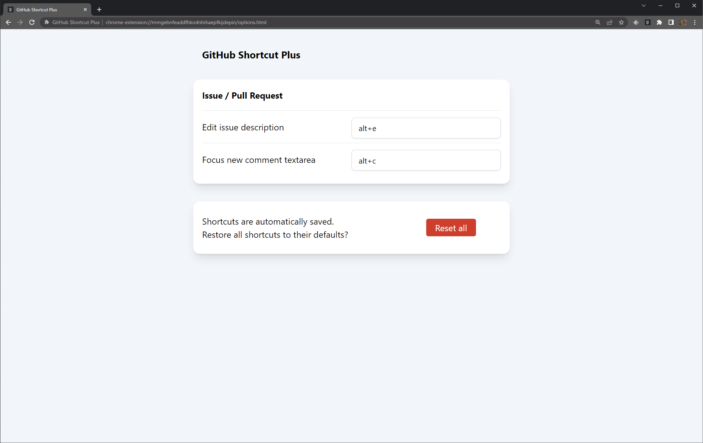

# GitHub Shortcut Plus

Browser extension to add more keyboard shortcuts to [github.com](https://github.com/).

## Keyboard shortcuts

- Edit issue description (default: <kbd>Alt+E</kbd>)

## Configuration

Customize the keyboard shortcuts from options page.

